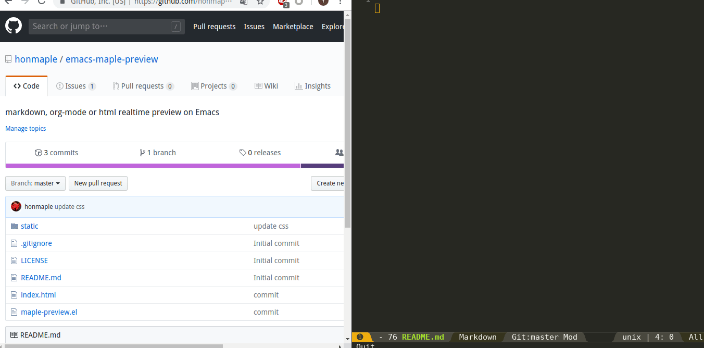

* previewer
  markdown, org-mode or html realtime preview on Emacs

** screenshot
   

** quickstart
   #+begin_src elisp
   ;; These are dependent libraries
   (use-package websocket)
   (use-package web-server)

   (use-package previewer
     :ensure nil
     :commands (previewer-mode))
   #+end_src

   Upstream source repository:
   #+begin_example
   https://github.com/honmaple/emacs-maple-preview
   #+end_example

** customize
   #+begin_src elisp
   ;; Preview http host
   (setq previewer-host "localhost")
   ;; Preview http port, t means use unused port
   (setq previewer-port t)
   ;; Delay preview when auto update is non-nil
   (setq previewer-delay 0.1)
   ;; Auto preview when insert
   (setq previewer-auto-update t)
   ;; Auto scroll when preview
   (setq previewer-auto-scroll t)
   ;; Auto open browser
   (setq previewer-auto-browser t)
   ;; only enable preview within some special modes
   (setq previewer-render-modes '(org-mode markdown-mode html-mode web-mode))
   ;; How to preview text, export to markdown or html
   (setq previewer-render-alist '((t . previewer-markdown-content)))
   ;; custom css or js file
   (add-to-list 'previewer-styles
                "<style type=\"text/css\">
                   body {
                       max-width: 800px;
                   }
                 </style>" t)
   (add-to-list 'previewer-scripts "https://cdn.bootcss.com/mathjax/2.7.6/MathJax.js" t)
   #+end_src

* Static Files(Already built-in)
  - css
    #+begin_example
    wget https://cdnjs.cloudflare.com/ajax/libs/github-markdown-css/5.5.1/github-markdown.min.css -O static/css/markdown.css
    wget https://cdnjs.cloudflare.com/ajax/libs/highlight.js/11.9.0/styles/github.min.css -O static/css/highlight.css
    #+end_example
  - js
    #+begin_example
    wget https://cdnjs.cloudflare.com/ajax/libs/jquery/3.7.1/jquery.min.js -O static/js/jquery.min.js
    wget https://cdnjs.cloudflare.com/ajax/libs/marked/12.0.1/marked.min.js -O static/js/marked.min.js
    wget https://cdnjs.cloudflare.com/ajax/libs/marked-highlight/2.1.1/index.umd.min.js -O static/js/marked-highlight.min.js
    wget https://cdnjs.cloudflare.com/ajax/libs/highlight.js/11.9.0/highlight.min.js -O static/js/highlight.min.js
    wget https://cdnjs.cloudflare.com/ajax/libs/mermaid/10.9.0/mermaid.min.js -O static/js/mermaid.min.js
    #+end_example

* FAQ
** How to preview mathematical expressions within org-mode?
   #+begin_src elisp
   (setq previewer-render-alist '((org-mode . previewer-html-content)
                                  (t . previewer-markdown-content)))
   #+end_src
   Then *previewer* will export org-mode as html with mathjax.js, if you want to custom beautiful css, use

   #+begin_example
     #+HTML_HEAD: <link rel="stylesheet" type="text/css" href="custom.css" />
   #+end_example

   or use =katex=
   #+begin_src elisp
   (add-to-list 'previewer-styles "https://cdn.jsdelivr.net/npm/katex@0.16.27/dist/katex.min.css" t)
   (add-to-list 'previewer-scripts "https://cdn.jsdelivr.net/npm/katex@0.16.27/dist/katex.min.js" t)
   (add-to-list 'previewer-scripts "https://cdn.jsdelivr.net/npm/marked-katex-extension@5.1.6/lib/index.umd.min.js" t)
   (add-to-list 'previewer-scripts
                "<script>
                 const markedKatexOptions = {
                   throwOnError: false
                 };
                 marked.use(markedKatex(markedKatexOptions));
                 </script>" t)
   #+end_src

** How to preview mermaid within org-mode?
   #+begin_src elisp
   (defun previewer/org-md-example-block (example-block _contents info)
     (format "```%s\n%s\n```"
             (org-element-property :language example-block)
             (org-remove-indentation
              (org-export-format-code-default example-block info))))
   (advice-add 'org-md-example-block :override 'previewer/org-md-example-block)
   #+end_src

   Then use src with mermaid flag
   #+begin_src mermaid
    graph TD
    A[nginx]
    B(log)
    C(upstream)
    A -->|write| B
    A -->|send| C
   #+end_src
** Not available in windows?
   Maybe it's because of the newline encoding problem in Windows
   #+begin_src elisp
   (defun custom-websocket-text (text)
     (if (eq system-type 'windows-nt)
         (replace-regexp-in-string "\n" "^M" text)
       text))

   (advice-add 'previewer-websocket-text :filter-return #'custom-websocket-text)
   #+end_src

   =^M= is =C-q C-m=
